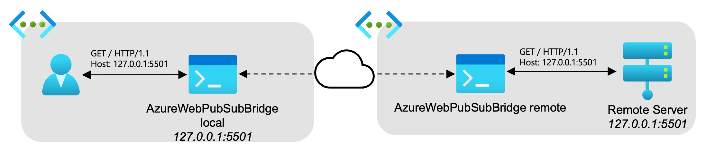
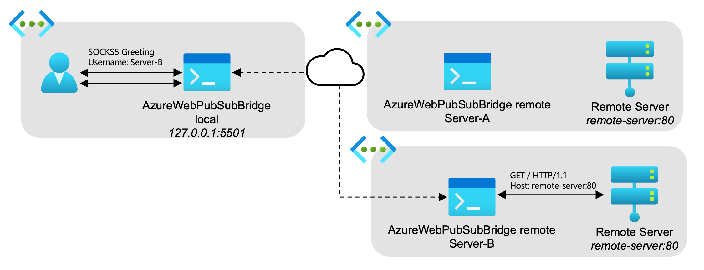
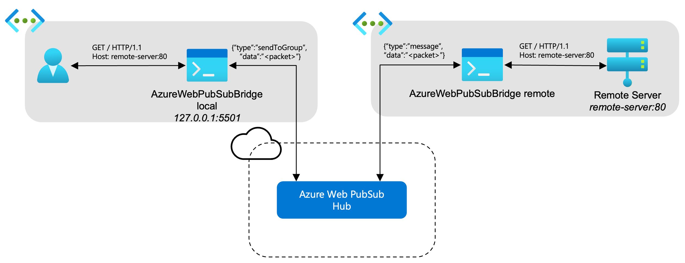
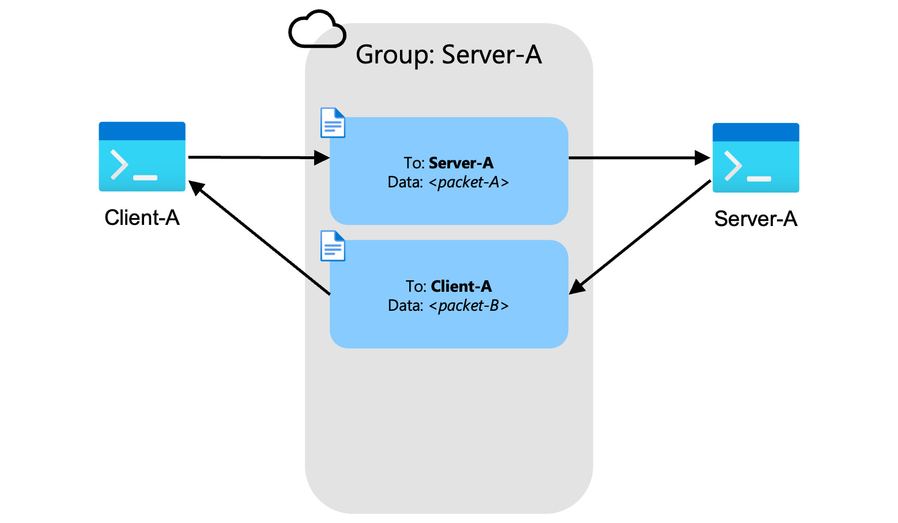
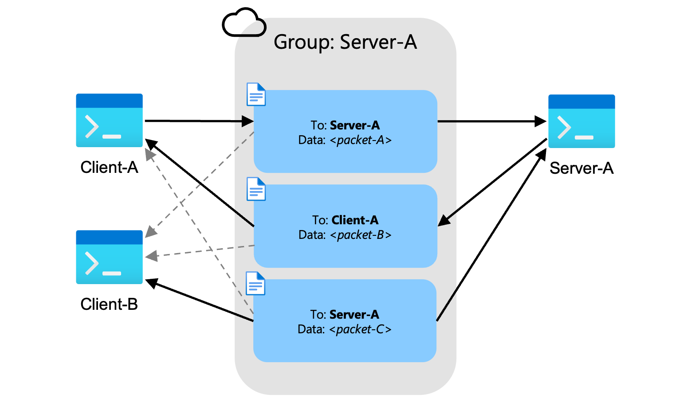

# Overview

This repo provides a TCP bridge using [Azure Web PubSub](https://learn.microsoft.com/azure/azure-web-pubsub/) WebSockets as a [tunneling protocol](https://www.wikipedia.org/wiki/Tunneling_protocol).

A tunneling protocol is a mechanism for transferring packets of data from one network to another and, depending on the proxy, can be done transparently for the end user. This repo leverages WebSockets from Azure Web PubSub as the tunneling protocol which benefits the client and server when they are unable to communicate directly to one another but both have access to Azure and Azure Web PubSub.

A bridge utilizes the tunneling protocol, in the case Azure Web PubSub, to act as the entrypoint and outlet for network traffic. The bridge will need to both be available as a local client and as a remote server in order to intercept and receive network traffic.

This repo uses [network bridge](https://www.wikipedia.org/wiki/Network_bridge) concepts. The bridge running on the local client and intercepting packets to place on to the tunnel is called a [local forwarder](src/AzureWebPubSubBridge/LocalForwarder.cs). The bridge running on the remote server and receiving packets from the tunnel is called the [remote forwarder](src/AzureWebPubSubBridge/RemoteForwarder.cs).

## Why Azure Web PubSub as a Tunnel

There are many tunneling options available however you may consider using Azure Web PubSub for the following reasons:

1. The client and server both have access to Azure or a [Private Endpoint](https://learn.microsoft.com/azure/azure-web-pubsub/howto-secure-network-access-control) within your private VNet that has access to Azure Web PubSub.
2. There may be many clients or many servers that results in many connections. Azure Web PubSub is built for [high frequency updates](https://learn.microsoft.com/azure/azure-web-pubsub/overview#what-are-the-benefits-using-azure-web-pubsub-service) and many WebSocket connections.
3. A desire to utilize industry standard WebSockets. The Azure Web PubSub SDK is not a requirement to utilize WebSocket connections and data transfer.

## Usage Details

### Prerequisites

- Latest [.NET SDK](https://dotnet.microsoft.com/download).
- [Microsoft Azure Subscription](https://learn.microsoft.com/dynamics-nav/how-to--sign-up-for-a-microsoft-azure-subscription).
- [Azure CLI](https://learn.microsoft.com/en-us/cli/azure/install-azure-cli).
- [Azure Web PubSub Service](https://learn.microsoft.com/azure/azure-web-pubsub/howto-develop-create-instance) resource with Hub.

### Building and Publishing

1. Build and publish to [target](https://learn.microsoft.com/dotnet/core/rid-catalog) host machine:
    - Windows: `dotnet publish -c Release --self-contained true -o bin -r win-x64`
    - Mac: `dotnet publish -c Release --self-contained true -o bin -r osx-x64`
    - Linux: `dotnet publish -c Release --self-contained true -o bin -r linux-x64`
2. Move to `bin` directory, `cd bin`

### Configuration

Update the `bin/appsettings.json` with new settings:

Generic configuration (all available as command line arguments):

- Change `Serilog:MinimumLevel:Default` to a desired log level.
- Change `Local:PubSubEndpoint` and `Remote:PubSubEndpoint` to a valid Azure Web PubSub endpoint.
- Change `Local:PubSubKey` and `Remote:PubSubKey` to a valid Azure Web PubSub key.
- Change `Local:Hub` and `Remote:Hub` to a valid hub name in the Azure Web PubSub service.
- Change `Local:Port` to a port that the local forwarder will listen on.
- Change `Remote:Connect:ServerId` to a unique ID that will identify the remote forwarder (maximum 32 characters).

One-to-one direct protocol configuration, when tunneling only to one remote forwarder from one to many clients:

- `Local:Connect:Port` - The port for the remote server.
- One of:
  - `Local:Connect:IpAddress` - IP Address for the remote server.
  - `Local:Connect:DomainName` - Domain name for the remote server.

### Running

Ensure you are authenticated to your Azure Subscription:

```shell
az login
```

For a list of all command arguments:

```shell
./AzureWebPubSubBridge --help
```

#### Local Forwarder

*Local forwarder* starts a local TCP listener that supports two protocols:

Direct protocol - The local forwarder only sends packets relating to a single server. Any connections made to the local forwarder will be sent to the configured IP Address or Domain Name:

```shell
./AzureWebPubSubBridge local direct
```

SOCKS5 protocol - The local forwarder will follow a SOCKS5 handshake to determine which server to tunnel to for the remote forwarder and which IP Address or Domain Name to send the packets. Refer below for SOCKS5 protocol specifics.

```shell
./AzureWebPubSubBridge local socks
```

#### Remote Forwarder

*Remote forwarder* starts an Azure Web PubSub WebSocket listener that supports the following:

Reliable WebSockets - The remote forwarder will guarantee packet delivery through the use of [reliable WebSockets](https://learn.microsoft.com/azure/azure-web-pubsub/howto-develop-reliable-clients). At the time of this writing, this feature of Azure Web PubSub is still in *preview*.

```shell
./AzureWebPubSubBridge remote --reliable true
```

Standard WebSockets - The remote forwarder will use standard WebSockets provided by Azure Web PubSub with guarantees on packets sent.

```shell
./AzureWebPubSubBridge remote
```

## Protocols

At the time of writing this there are two supported protocols for this bridge. The first being `direct` which is a local forwarder sending TCP packets to only one remote forwarder. The second is `socks` which leverages the SOCKS5 protocol for clients able to utilize a SOCKS5 proxy for their connections.

### Direct

The *direct forwarder* handles simply setting up a [local forwarder](#local-forwarder) that will send all TCP packets it receives to a specific [server group](#groups). Generally only one [remote forwarder](#remote-forwarder) should be listening for messages from one server group.

This style of *local forwarder* should make sending packets to a specific *remote forwarder* fairly straightforward as demonstrated in the following diagram:



A couple details to consider when using this forwarder:

- All traffic sent to the local forwarder will be sent along to the remote forwarder, as long as it is started and listening for messages in its server group.
- The host address will need to match both the local forwarder's address and the remote server's address.

#### Hosts File

If the remote IP address and port can match the local IP address and port then a pass through of packets should be transparent which is only a concern for clients that embed host information in their packets, such as browsers with HTTP/S.

However, clients needing to connect to specific DNS names can instead update their `hosts` file on their local machine to point *loopback* addresses to these DNS names. Then start the *local forwarder* in direct mode and bind to the loopback address and specific port that's needed.

### SOCKS5

A *local forwarder* setup with [SOCKS5](https://www.wikipedia.org/wiki/SOCKS#SOCKS5) support will first initialize all connections by receiving and sending SOCKS5 packets. If the initial set of packets are not in SOCKS5 form then the connection will be terminated.

An example of this protocol looks like the following diagram:



Refer to the [RFC 1928](https://datatracker.ietf.org/doc/html/rfc1928) for more information. The following are additional caveats related to the bridge:

- Username/password auth is **required** when using the SOCKS5 protocol. All other authentication methods are not supported.
  - The `username` field is used to determine which server group the connection from the *local forwarder* should join to send TCP packets.
  - The `password` field is currently **ignored**, but could be used to authorize access to a particular server group.
- TCP/IP CONNECT is the **only** supported connection request.

## Design Details

Azure Web PubSub provides a service that enables real-time messaging with WebSockets. Subscribers connect to the WebSocket provided by Azure Web PubSub then join a corresponding group. Any data sent to this group is then transmitted to subscribers of the group. With this concept in mind, we can create a tunnel by subscribing a remote server to a WebSocket group. Then transform TCP packets into WebSocket messages and send them into that remote server's group. The remote server will then decode these messages and send them as their original TCP packets to the remote destination.



Response messages from the remote destination will then be transformed into their own WebSocket messages and sent into the group with a destination back to the local client. The local client will pick up these messages, decode them into response TCP packets and send them back to the client TCP connection.

### Groups

Packets are encoded into WebSocket messages and sent into a group that has any number of subscribers. The packets are labeled with a destination address of who in the group should process the message.



In the case where there are multiple clients connecting to a server then there will be multiple clients subscribing to messages within the group. Clients will receive these messages from the group and will look at the destination address to determine if they should process the message. Messages not destined for the current client will be dropped.



### Multiple Client Considerations

This bridge currently supports multiple clients connecting to one server however the following should be considered:

- Every message will be sent to every client and server. The logic within the bridge will handle dropping the message or processing the message.
- Additional clients will increase latency linearly with data transferred from each of the clients and from the server.
- Potential security implications with data being sent to all clients within the group.

If any of these are a concern then follow the following recommended approaches:

- Ensure the destination remote server uses TLS encryption, this will result in packets that are encrypted by the client and server.
- Add multiple remote bridge servers and use load balancing from the client connection.
- If strict security is required then only allow one client to connect to one server at a time.